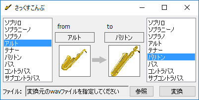

サックス専用移調ソフト さっくすこんぶ ver.0.1
==============================================

## これは何？

サックスで演奏（録音）したオーディオデータを移調させるソフトです。
ぼっちでも、サックスが一本しかなくても、サックスアンサンブルが実現します。

## 使い方

サックスを演奏します。
楽譜を読み換える必要はありません。楽譜の通りお吹きください。

左側から移調する前の（演奏に用いた）サックスを選びます。
右側で移調させたいサックスを選びます。
変換ボタンを押すと移調後のオーディオファイルとして書き出されます。

## 作った人

<dl>
  <dt>プログラム</dt><dd>そらくり (Twitter: @karanokuri)</dd>
  <dt>アイコン</dt><dd>神宮 (Twitter: @zing_norito)</dd>
</dl>

## 著作権および免責事項

本ソフトはフリーソフトです。ご自由にお使い下さい。
本ソフトの著作権は そらくり が保有しています。

本ソフトを使用したことによって生じたすべての障害・損害・不具合等に関して、
当方は一切の責任を負いません。各自の責任においてご使用ください。

## 謝辞

このソフトはD言語で開発しています。

> DMD32 D Compiler v2.063.2  
> Copyright (c) 1999-2013 by Digital Mars written by Walter Bright  
> http://dlang.org/

GUIの開発にあたって、DFLを使用させて頂きました。

> D Forms Library  
> Version 1.0 by Christopher E. Miller  
> http://wiki.dprogramming.com/Dfl/HomePage
